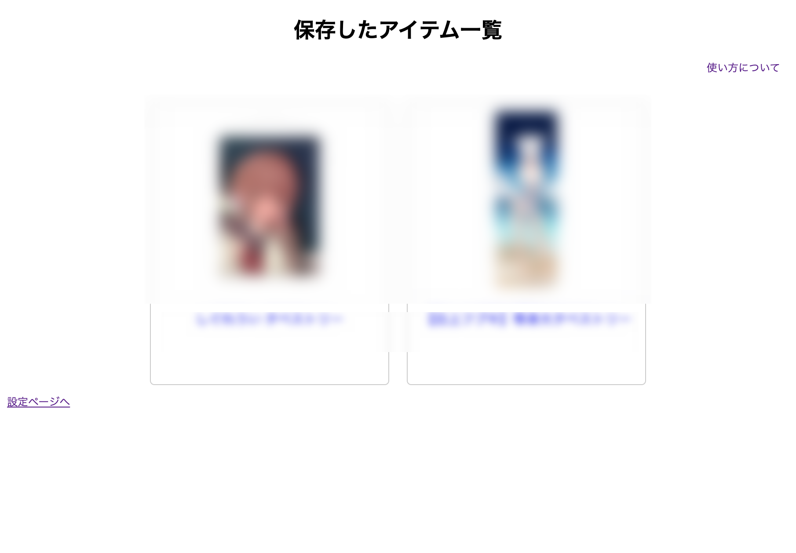

*この機能は実験的機能のため、今後機能しなくなる可能性もあります。ご了承ください。*
# 購入物の保存機能について

購入したものの、出品者がその情報を消してしまうと、情報にアクセス出来なくなってしまいます。

そこで、Chrome内にデータを保管し、基本的な内容だけは確認できるようにしました。

chrome拡張機能->Better Booth->オプションをクリックすると、保存したアイテム一覧というページに着きます。
データが保存されている場合、このページに保存した商品一覧が表示されます。

アイテムはクリックすると詳細ページに飛ぶことができ、アイテムの説明欄などを見ることができます。

## 仕様について
この機能は、`chrome.storage.local`を使用しています。<br>
また、データ容量をできるだけ少なくするために、json形式を採用しています。

```js=
{
    additionalDescription: "<section> ... </section>",
    Description: ...,
    id: ...,
    images: [...,],
    name: ...,
    price: ...,
    shop: {
        name: ...,
        subdomain: ...,
        url: ...
    }
}
```
基本的には、BOOTH側が提供しているJSONファイルの一部を切り取ったものを用意し、足りない部分をadditionalDescriptionで補っているという形になります。<br>
このデータ量は画像を含んでいないため、数百件を保存したとしても問題は無いと考えられますが、あまりにも多すぎる場合はストレージを圧迫する可能性が考えられます。<br>
その場合は、"データをエクスポート"からデータをダウンロードし、chromeからは削除してください。

