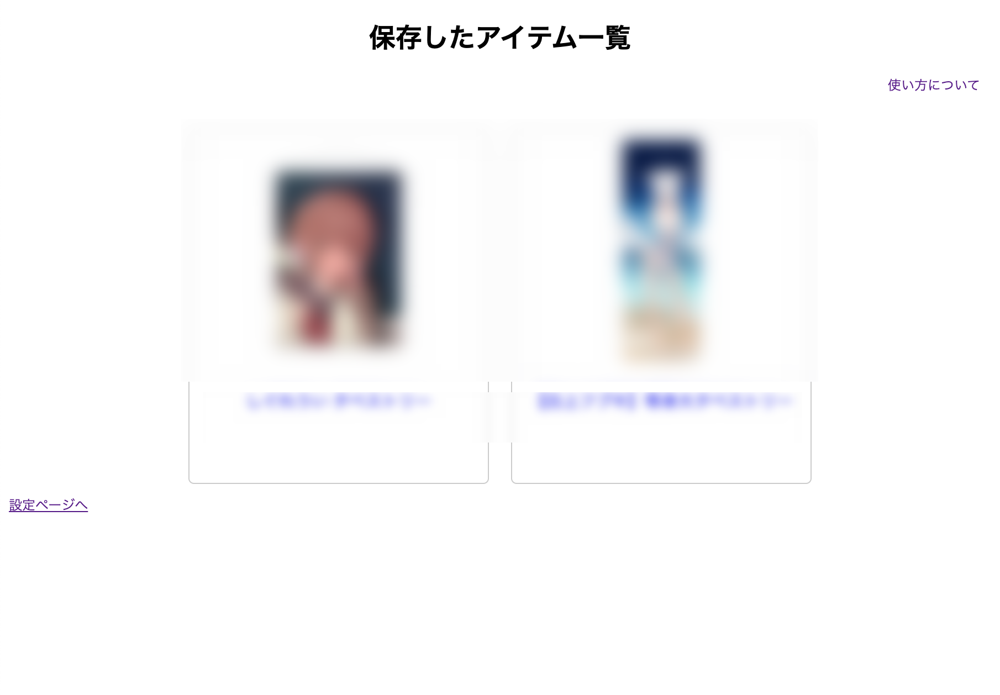

*Note: This feature is experimental, and there is a possibility that it may no longer function in the future. Please be aware of this.*

[日本語](./README.md)

# About the Purchase Item Saving Feature

When you purchase something and the seller deletes that information, you lose access to the details of the purchase.

To address this issue, we store the data within Chrome, allowing you to access the essential information even if the seller removes it.

## How to Add an Item
A new button will be added to the item details page.<br>
By clicking this button, the item data will be automatically collected and saved within Chrome.<br>


## How to Check Saved Items
Click on the Chrome extension->Better Booth->Options, and you will be taken to a page called "Saved Items List".<br>

<br>
If data is saved, a list of saved items will be displayed on this page.<br>

Clicking on an item will take you to the detailed page, where you can view the item's description and other information.


## How to Add an Item (Version 0.3.1 and above)
From version 0.3.1 onwards, we have added the feature to import items.<br>
This is mainly for re-registering data that was accidentally exported, and files created manually may not function as expected. Please keep this in mind.

## Specifications
This feature uses `chrome.storage.local`.<br>
To minimize data size, we have adopted the json format.

```js=
{
    additionalDescription: "<section> ... </section>",
    Description: ...,
    id: ...,
    images: [...,],
    name: ...,
    price: ...,
    shop: {
        name: ...,
        subdomain: ...,
        url: ...
    }
}
```
Basically, we prepare a portion of the JSON file provided by BOOTH and complement the missing parts with additionalDescription.<br>
Since this data does not include images, it should not be a problem even if you save hundreds of items. However, if you save an excessive number of items, it may fill up your storage space.<br>
In that case, you can download the data from "Export Data," and then delete it from Chrome.